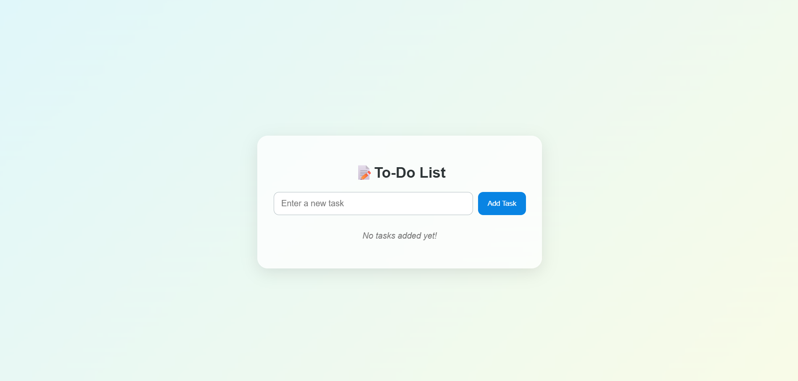
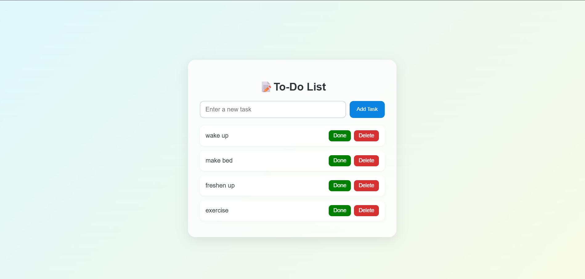
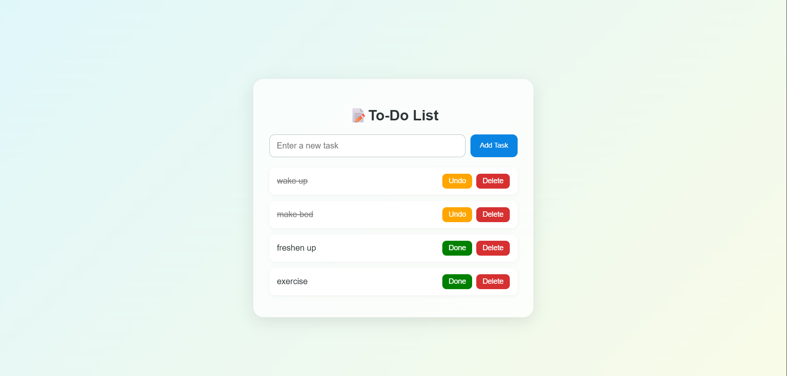

# 📝 To-Do List App with Local Storage

## 📌 Task

**Create a To-Do List or Note-Taking App with Local Storage**

> **Objective:** Implement data persistence using `localStorage`  
> **Action:** Enhance the to-do list app so that tasks are saved and retrieved even after refreshing or closing the browser.

---

## 🚀 Project Description

This is a **responsive and interactive To-Do List Web App** built using **HTML**, **CSS**, and **JavaScript**. It allows users to:

- ✅ Add new tasks  
- ✅ Mark tasks as **"Done"** or **"Undo"**  
- ✅ Delete tasks  
- ✅ Automatically save and retrieve tasks using **`localStorage`**

The UI features smooth animations, color-coded buttons, and a **3D-style container design** for a modern, visually appealing experience.

---

## 🛠️ Technologies Used

- **HTML5**
- **CSS3** (with Flexbox, Gradients, 3D Effects)
- **JavaScript** (DOM manipulation, `localStorage` API)

---

## 💡 Features

- 📌 Add, mark, and delete tasks  
- 💾 Persistent task storage using `localStorage`  
- 💻 Responsive layout for both desktop and mobile devices  
- 🌈 Color-coded buttons for better UX  
- 🎨 3D-styled container with hover tilt effects  
- 🔄 Smooth animations and transitions for task interaction  

---

## 🧪 How to Run

1. **Download** or **clone** the project folder  
2. Open the file `index.html` in your browser  
3. Start using the app — tasks will automatically be saved using localStorage

---

## 🌐 Live Demo

👉 [Click here to view the live demo](https://lavs2005.github.io/Apex-Task-4-Todolist/)

## 📷 Screenshot

---

